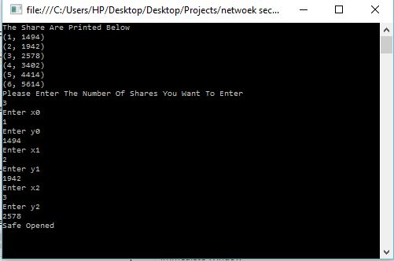

# Network-Security
Implementing Shamir Secret Sharing Scheme

Just download the Zip then exract it somewhere.After that import it to visual studio or just open the sln file.Select program.cs in Solution explorer to view the code and run it to understand the Shamir's secret Sharing Scheme.

A wikipedia link to understand the Shamir Secret Sharing Scheme:
https://en.wikipedia.org/wiki/Shamir%27s_Secret_Sharing

